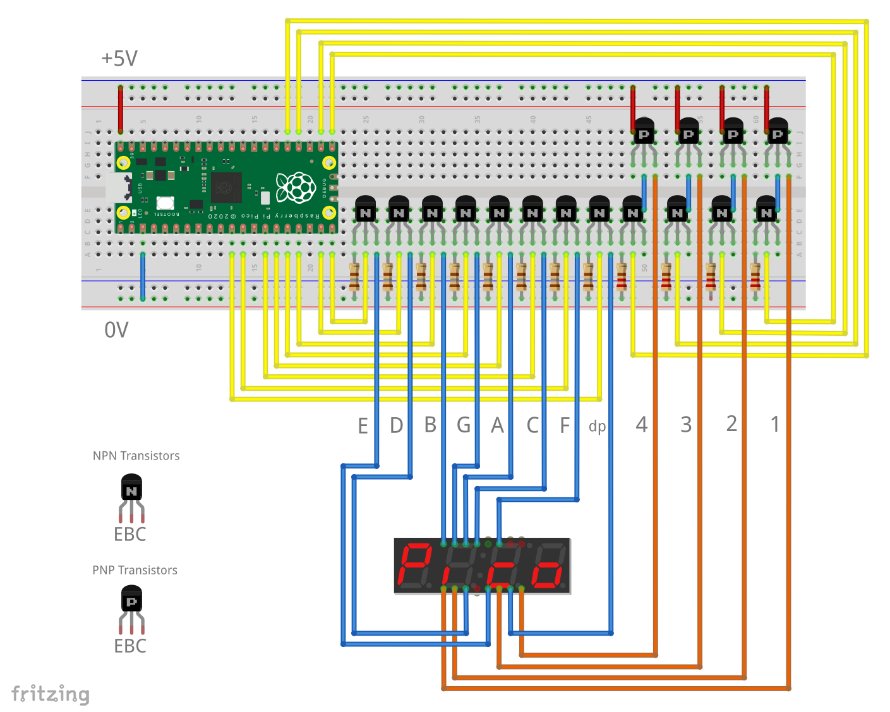

= Driving a 7 segment LED display
This example demonstrates how a PIO state machine can be used to control a four digit multiplexed 7-segment display with the Raspberry Pi Pico (RP2040).

Multiplexed displays work by rapidly displaying each digit in turn and the PIO provides an excellent way to relieve the CPU of this time-consuming task.

The total current required is typically more than the GPIO pins can supply so you'll need an external drive circuit similar to that shown.

The PIO code uses four `side-set` pins to control the digit multiplex lines and displays the segment patterns received on the FIFO. It uses a non-blocking PULL to keep showing the same segments until the CPU sends new data.

The provided example uses spells out the word **Pico** and then counts from 0 to 9999.

== Wiring information
Connect the display to your board using a circuit like the one below, according to your display and the pinout of your transistors.

Connect the circuit to an external 5V supply or power it via USB (in which case reconnect the _+5V_ rail to _VBUS_ instead of _VSYS_).

TIP: this circuit is for a _common anode_ display that takes about 15mA per segment.

[[pio_seven_segment_wiring-diagram]]
[pdfwidth=75%]
.Wiring diagram
